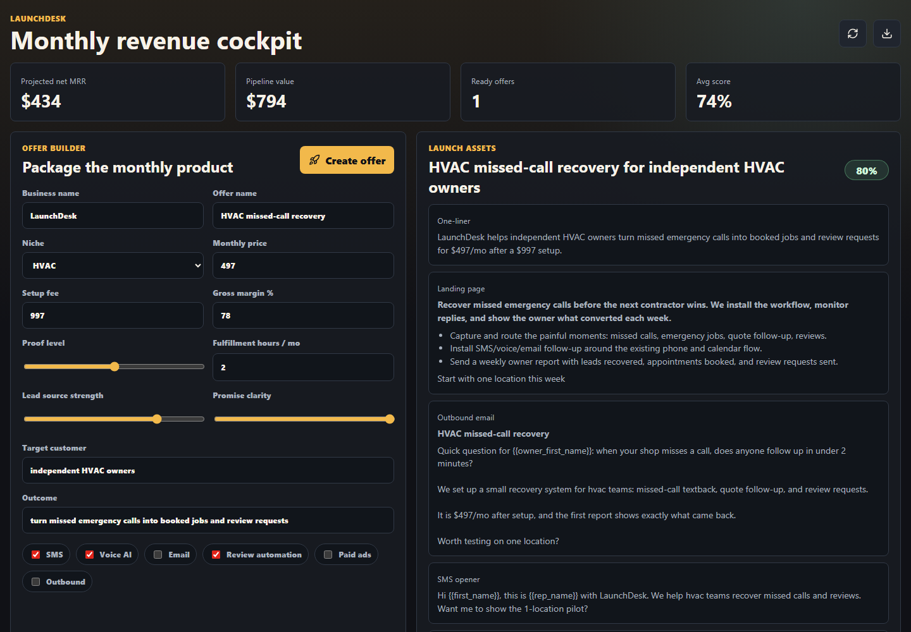

# LaunchDesk

[](https://github.com/imperator-clawdius/launchdesk/releases)
[](LICENSE)
[](docs/DEPLOYMENT.md)

**A free, open-source, MIT-licensed service for turning small service ideas into monthly revenue systems.**

LaunchDesk helps independent builders, students, freelancers, and local operators package a simple offer, score whether it can become recurring revenue, generate launch copy, and track the first leads without buying a heavy CRM.

It is a public GitHub repo you can fork, self-host, inspect, modify, teach with, or run as a lightweight operator service. It is not another generic app builder. It is a practical launch desk for the hard part after the app exists: choosing a narrow customer, making a clear promise, reaching real people, and learning from the pipeline.



## Why This Exists

Most people do not need more business theory. They need a small system that helps them do the next useful thing:

- Pick one customer type.
- Make one monthly offer.
- Write the first landing-page, email, and SMS copy.
- Track the people they contact.
- Keep improving based on replies, calls, pilots, and retained revenue.

LaunchDesk is meant to be a free open-source starting point for that. Take it, run it locally, deploy it privately, change it, teach with it, or use it to help someone build a steadier life. It is released under the [MIT License](LICENSE).

## What It Does

- Scores a monthly offer by niche fit, pricing, margin, proof, fulfillment effort, lead source, clarity, and channel mix.
- Generates launch assets: one-liner, landing-page copy, outbound email, SMS opener, onboarding checklist, weekly report template, and risks.
- Tracks leads by stage so the work stays visible.
- Exposes a small JSON API for offers, leads, summaries, exports, metadata, and health checks.
- Runs as a simple Node/Express app with JSON-file persistence.
- Ships with Docker, Render Blueprint config, tests, smoke test, and operator authentication for hosted deployments.

## Good First Use Case

The default wedge is:

**AI missed-call recovery + review automation for HVAC, plumbing, and auto repair shops.**

Those businesses already understand paying monthly for calls, bookings, reviews, and follow-up. LaunchDesk can also be adapted for dental offices, local law firms, med spas, trades, solo consultants, campus projects, community programs, or any small service offer that needs a repeatable go-to-market loop.

## Quick Start

```powershell
git clone <your-fork-url>
cd launchdesk
npm install
npm test
npm run smoke
npm start
```

Open:

```text
http://localhost:4177
```

By default, local development is open. Set `AUTH_PASSWORD` before hosting it.

## Environment

Copy `.env.example` to `.env` if you want local config.

```text
PORT=4177
DATA_FILE=./data/launchdesk.json
APP_BASE_URL=http://localhost:4177
AUTH_USER=admin
AUTH_PASSWORD=change-me-before-deploy
NODE_ENV=production
```

`AUTH_PASSWORD` enables basic operator authentication. Keep it set in any hosted environment.

## Deploy

The shortest production path is Render:

1. Push this repo to GitHub.
2. Create a Render Blueprint from `render.yaml`.
3. Set `AUTH_PASSWORD` to a strong value.
4. Deploy.
5. Confirm `/api/health` is healthy.
6. Log in, create one offer, and export the workspace.

Full deployment notes: [docs/DEPLOYMENT.md](docs/DEPLOYMENT.md)

## API

| Method | Route | Purpose |
| --- | --- | --- |
| `GET` | `/api/health` | Service health check |
| `GET` | `/api/meta` | Niches, channels, and lead stages |
| `GET` | `/api/summary` | Dashboard totals |
| `GET` | `/api/offers` | List scored offers |
| `POST` | `/api/offers` | Create an offer |
| `GET` | `/api/offers/:id` | Get one offer |
| `PUT` | `/api/offers/:id` | Update one offer |
| `DELETE` | `/api/offers/:id` | Delete one offer |
| `GET` | `/api/leads` | List leads |
| `POST` | `/api/leads` | Create a lead |
| `PUT` | `/api/leads/:id` | Update one lead |
| `DELETE` | `/api/leads/:id` | Delete one lead |
| `GET` | `/api/export` | Export workspace data |

## Project Structure

```text
launchdesk/
  public/              browser UI
  src/                 Express backend, scoring, JSON store
  test/                Node test runner tests
  scripts/smoke.js     local end-to-end smoke test
  docs/                deployment, operating manual, GitHub Pages landing
  render.yaml          Render Blueprint
  Dockerfile           container runtime
```

## Operating Philosophy

LaunchDesk is intentionally small.

Do not add ten niches before one gets replies. Do not build a marketplace before one pilot pays. Do not automate outreach before you understand which words get an owner to answer.

The loop is:

1. Package one monthly offer.
2. Add 50 leads.
3. Send 20 direct outreach touches per day.
4. Book calls.
5. Run one pilot.
6. Report the result weekly.
7. Keep what converts.

More detail: [docs/OPERATING_MANUAL.md](docs/OPERATING_MANUAL.md)

## Roadmap

See [docs/ROADMAP.md](docs/ROADMAP.md).

The short version:

- Add optional SQLite/Postgres storage.
- Add simple login sessions.
- Add Stripe checkout for paid pilots.
- Add CSV import/export.
- Add integrations only after the manual workflow proves useful.

## Contributing

Contributions are welcome, especially improvements that help ordinary people launch useful small services without wasting money.

Start here:

- [CONTRIBUTING.md](CONTRIBUTING.md)
- [CODE_OF_CONDUCT.md](CODE_OF_CONDUCT.md)
- [SECURITY.md](SECURITY.md)

Good first issues:

- Improve accessibility and keyboard navigation.
- Add CSV import/export.
- Add more transparent score explanations.
- Add local-language templates.
- Add an education mode for classrooms or workshops.

## License

MIT. See [LICENSE](LICENSE).

Use it freely. Fork it. Teach with it. Run it for your own local project. Help someone make a small honest offer and follow through.
